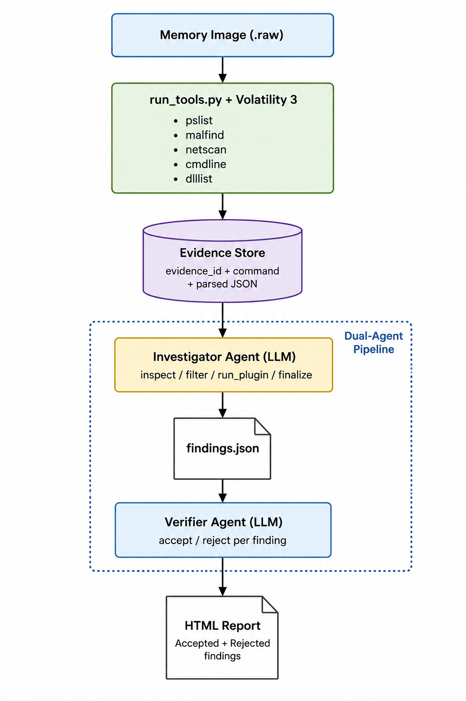

# DFIR Autonomous Investigation Agent

> **Submission Compliance Checklist**
> | Requirement | Status | Location |
> |---|---|---|
> | Public repository | ✅ | github.com/DivitaP/dfir-agent |
> | MIT License file | ✅ | [LICENSE](./LICENSE) |
> | README with setup instructions | ✅ | This file, [Setup](#setup) section |
> | Step-by-step run instructions | ✅ | This file, [How to Run](#how-to-run) section |
> | Text description of features | ✅ | This file, [What It Does](#what-it-does) section |
> | Demo video | ✅ | [Demo Video](#demo-video) section below |
> | Architecture diagram | ✅ | [docs/architecture.png](./docs/architecture.png) |
> | Evidence dataset documentation | ✅ | [Evidence Dataset](#evidence-dataset) section below |
> | Accuracy report | ✅ | [Accuracy Report](#accuracy-report) section below |
> | Agent execution logs | ✅ | [Agent Execution Logs](#agent-execution-logs) section below |

---

## Demo Video

[\[DFIR Autonomous Investigation Agent — AI Memory Forensics with Self-Verification\]](https://youtu.be/rTGfSVvpBLg)

The video shows: the dataset, the dual-agent architecture, a live run of the pipeline, the verifier independently rejecting unsupported findings (self-correction), the traceable HTML report, and an honest walkthrough of current limitations.

---

## What It Does

An autonomous memory forensics agent that investigates Windows memory images end to end — collecting evidence, reasoning over it, validating its own conclusions, and generating a traceable incident report — without any human in the loop.

The agent takes a raw memory dump, runs a structured set of Volatility 3 plugins, and produces a JSON evidence store where every tool execution has a unique evidence ID. An investigator agent then reasons over that evidence: it requests specific views, filters by PID, runs additional plugins when needed, and produces findings where every claim cites at least one evidence ID. A separate verifier agent independently reviews each finding against its cited evidence and rejects anything it cannot support. The final HTML report shows accepted findings with full evidence citations alongside a "Rejected Findings" section that documents what the verifier caught.

**Key capabilities:**
- Autonomous multi-turn investigation with a 10-action reasoning budget
- Every finding cites specific evidence IDs traceable to exact Volatility tool executions
- Dual-agent architecture: investigator and verifier are independent LLM passes
- Verifier rejects hallucinated evidence IDs and unsupported claims — self-correction without human intervention
- HTML report with PDF export showing accepted and rejected findings
- Disk-cached Volatility results and LLM responses for reproducibility

---

## Architecture



```
Memory Image (.raw)
        |
        v
run_tools.py + Volatility 3
(pslist, pstree, cmdline, netscan, malfind, dlllist)
        |
        v
Evidence Store (evidence/store.json)
{ evidence_id, tool, action, command, timestamp, raw_output, parsed }
        |
        v
Investigator Agent (LLM — llama-3.1-8b-instant via Groq)
Actions: inspect / filter / run_plugin / finalize
Each finding must cite evidence_ids
        |
        v
findings.json
        |
        v
Verifier Agent (LLM — independent pass)
Verdict: accept / reject with reason per finding
        |
        v
HTML Report (evidence/report.html)
Accepted findings + Rejected findings (caught by verifier)
```

---

## Evidence Dataset

**Test dataset:** MemLabs by stuxnet999 — public Windows 7 memory images with documented ground truth, widely used in the DFIR community for training and tool validation.

- **Lab 1:** `MemoryDump_Lab1.raw` (1GB) — Windows 7 image containing process injection and suspicious network activity. Ground truth documented at github.com/stuxnet999/MemLabs/tree/master/Lab%201
- **Lab 2:** `MemoryDump_Lab2.raw` (1GB) — secondary Windows 7 image used to confirm the pipeline generalizes.

Because the ground truth is publicly documented, any judge can download the same image, run the agent, and check its findings against the known answers without needing proprietary case data.

Memory images are not included in the repository due to size (1GB each):

```bash
# Download from MemLabs releases
https://github.com/stuxnet999/MemLabs/releases

# Place in samples/ directory
mkdir samples
mv MemoryDump_Lab1.raw samples/
```

---

## Accuracy Report

Tested against MemLabs Lab 1.

**What works today:**
- The full pipeline runs end to end: evidence collection, autonomous investigation, independent verification, and report generation.
- Every finding carries evidence IDs traceable to a specific Volatility command in the evidence store.
- The verifier independently reviews each finding against its cited evidence and rejects unsupported claims with specific, substantive reasoning.

**Current limitation (stated honestly):**
The investigator currently runs on the lightweight `llama-3.1-8b-instant` model due to free-tier API budget constraints. At this model size the investigator produces weak findings, and in test runs the verifier correctly rejected all of them. This is not the verifier failing — it is the verifier working. A run that rejected every weak finding demonstrates that the self-correction layer holds even when the investigator underperforms. The verifier architecture is model-independent; a stronger investigator model produces better-grounded findings without any change to the verification logic.

**Documented failure modes and how they are handled:**

| Failure Type | Description | Response |
|---|---|---|
| Hallucinated evidence ID | Agent cited a truncated/fabricated ID (e.g. `EV-948`) | REJECTED — ID not found in store |
| Unsupported confidence | Single weak signal claimed as high confidence without corroboration | REJECTED — insufficient evidence |
| Overclaimed correlation | Claimed one PID in both malfind and netscan; evidence showed multiple uncorrelated PIDs | REJECTED — verifier checked against raw rows |
| Redundant tool calls | Agent attempted to re-run already-executed plugins | BLOCKED at code level before the LLM call |
| Investigator looping | 8B model repeats filter actions across turns | Known issue, tracked in limitations |

**Honesty over perfection:** all rejection events are preserved in `evidence/verified.json` and displayed in the report under "Rejected Findings — Caught by Verifier." A clean report with no rejections would indicate the verifier is not working, not that the agent is perfect.

---

## Agent Execution Logs

Agent execution logs are written to `evidence/` on every run:

| File | Contents |
|---|---|
| `evidence/store.json` | Every Volatility tool execution: evidence_id, command, timestamp, raw output, parsed JSON rows |
| `evidence/findings.json` | Every finding produced by the investigator agent: claim, evidence_ids, confidence, category |
| `evidence/verified.json` | Every verifier verdict: finding + verdict (accept/reject) + reason |
| `evidence/report.html` | Human-readable report with full traceability |

**Tracing a finding to its tool execution:**
1. Open `evidence/verified.json`, pick any finding
2. Copy one of its `evidence_ids` (e.g. `EV-94b2231c`)
3. Open `evidence/store.json`, search for that ID
4. The entry shows the exact Volatility command run, timestamp, and full parsed output

Every finding is traceable to a specific tool execution. This is enforced architecturally — the investigator can only cite IDs that exist in the store, and the verifier checks each cited ID independently.

---

## Setup

### Requirements
- Python 3.11+
- Volatility 3 (`pip install volatility3`)
- Groq API key — free at console.groq.com
- Git

### Install

```bash
git clone https://github.com/DivitaP/dfir-agent.git
cd dfir-agent
python3 -m venv venv && source venv/bin/activate
pip install volatility3 groq
export GROQ_API_KEY="your-groq-api-key"
```

---

## How to Run

**Step 1: Download a memory image**
```bash
mkdir samples
# place MemoryDump_Lab1.raw in samples/
```

**Step 2: Collect evidence**
```bash
python run_tools.py samples/MemoryDump_Lab1.raw
```
Runs Volatility plugins and populates `evidence/store.json`. Results are cached to `evidence/cache/`, so re-runs are instant.

**Step 3: Run the full agent pipeline**
```bash
python run_agent.py samples/MemoryDump_Lab1.raw
```
Runs investigator agent, verifier agent, and report generator in sequence.

**Step 4: View the report**
```bash
open evidence/report.html   # macOS
# click "Download PDF" in the top right to export
```

**Example output (from a real run):**
```
=== INVESTIGATOR ===
[turn 0] filter EV-ed617649
[turn 1] run_plugin windows.cmdline
[turn 2] filter EV-72fad94b
...
Produced 3 findings

=== VERIFIER ===
  [REJECTED] Suspicious process with non-shell parent PID
           Reason: cited evidence shows typical system process behavior, does not support the claim
  [REJECTED] High confidence C2 activity (PID in both malfind and netscan)
           Reason: evidence shows multiple uncorrelated PIDs, contradicts single-PID claim
  [REJECTED] Process running from user directory
           Reason: process list shows system directory paths, does not support the claim

=== REPORT ===
Report written to evidence/report.html
```

The verifier rejecting weak findings is the system working as designed. See the [Accuracy Report](#accuracy-report) for the full explanation.

---

## Implementation Note — Tool Orchestration

This project implements a Python-native agentic loop rather than MCP for tool orchestration. The investigator agent autonomously decides which Volatility 3 plugins to invoke, in what sequence, and with what parameters, based on evidence accumulated across turns — satisfying the "comparable agentic framework" provision in the rules. Direct subprocess calls were chosen to keep tight control over evidence ID assignment, token-safe output summarization, and the caching layer that makes runs reproducible. The dual-agent self-correction mechanism and evidence traceability are fully implemented regardless of transport layer.

---

## Project Structure

```
dfir-agent/
├── agent/
│   ├── investigator.py   # investigator agent loop (10-action budget)
│   ├── verifier.py       # verifier agent (independent LLM pass)
│   ├── reporter.py       # HTML report generator
│   └── prompts.py        # forensic heuristics system prompt
├── tools/
│   ├── executor.py       # Volatility 3 wrapper with disk cache
│   ├── store.py          # evidence store read/write
│   └── summarize.py      # token-safe evidence summarizer
├── docs/
│   └── architecture.png  # architecture diagram
├── run_tools.py          # step 1: collect evidence from memory image
├── run_agent.py          # step 2: investigate, verify, generate report
├── LICENSE               # MIT License
└── README.md             # this file
```

---

## License

MIT License — see [LICENSE](./LICENSE)